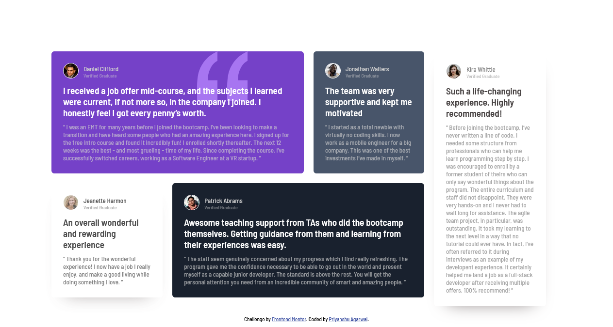

# Frontend Mentor - Testimonials grid section solution

This is a solution to the [Testimonials grid section challenge on Frontend Mentor](https://www.frontendmentor.io/challenges/testimonials-grid-section-Nnw6J7Un7). Frontend Mentor challenges help you improve your coding skills by building realistic projects. 
## Table of contents

- [Overview](#overview)
  - [The challenge](#the-challenge)
  - [Screenshot](#screenshot)
  - [Links](#links)
- [My process](#my-process)
  - [Built with](#built-with)
  - [What I learned](#what-i-learned)
- [Author](#author)

## overview

### The challenge

Users should be able to:

- View the optimal layout for the site depending on their device's screen size
### Screenshot

### Links

- Live Site URL: [Frontend Mentor - Testimonials grid section solution]()

### Built with

- Semantic HTML5 markup
- CSS custom properties
- Flexbox

### What I learned

Working with this project made me realize what's the true meaning of learning by working.
While working on this project I learned concepts like :-

-dividing and conquer technique
-Flexbox properties 
-box-shadow's properties
-making a responsive design

## Author

- Website - [Frontend Mentor - Testimonials grid section solution]()
- Frontend Mentor - [@Priyanshu4206](https://www.frontendmentor.io/profile/Priyanshu4206)